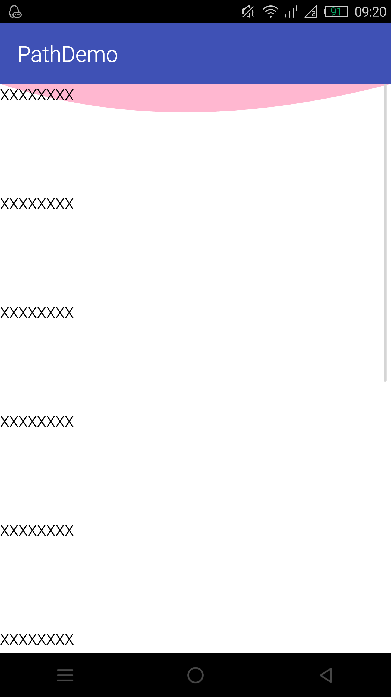
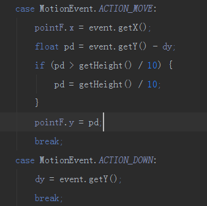
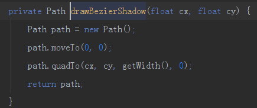
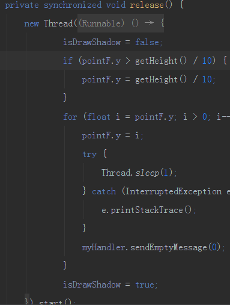

#ScrollView滑动到顶部后的阴影反馈效果
##### >当ScrollView滑动到顶部后，根据手指在屏幕上继续下拉出现的阴影效果的简单实现方式，仅供学习参考，在实际项目中引用还需慎重！！！
#####技术点：
#####1、利用Path中的moveTo() 、quadTo()方法实现的二阶贝塞尔曲线生成阴影
 >moveTo()方法就不做过多的介绍了，可以简单的理解为一个起始点。而quadTo()方法是android为开发者提供的一个生成二阶贝塞尔曲线方法，一段曲线用二阶足以！当然，还有三阶贝塞尔曲线生成方法：cubicTo(),然而android也只为我们提供到三阶，因为更高阶的贝塞尔曲线可以通过结合二阶和一阶来实现，其实贝塞尔曲线的核心就在于那个控制点，比如二阶曲线的控制点数量为1，三阶曲线的控制点数量为2... n阶曲线的控制点数量为n-1，以此类推。cubicTo()方法需要四个参数，这四个参数是干什么用的，或者说是怎么去传呢？前两个就是我们所说的核心：控制点坐标x，y，而后两个参数也是需要一个坐标，就是与moveTo()方法之对应的终点坐标，就好比moveTo()方法和lineTo方法成对使用是一个道理，要画一条直线肯定至少需要两个点：moveTo()是起点lineTo()是终点，而画一个二阶贝塞尔曲线也要依赖两个点moveTo()是起点，quadTo()的后两个参数为终点。好了，曲线出来了，那么怎么让曲线以上的部分变成阴影呢？实现也简单，设置好画笔就可以了，利用Paint的setStyle()方法传递Paint.Style.FILL参数即可，最后传入带有透明度的颜色即可，效果如下图
#####
#####2、如何根据手势滑动来控制这段曲线？
>这个问题也是实现此效果的核心，当然也是很简单的，简单的说下思路。首先我们要重写已经玩烂的onTouchEvent()方法,在 ACTION_DOWN中记录下手指按下的Y坐标，在ACTION_MOVE中算出实时的距离：就是当前手指的位置 - 初始按下的位置 ，就像这样
#####
>然后我们将上面介绍过的贝塞尔曲线画法封装一下就像这样：
#####
>因为需求确定，起始点就定在了屏幕的左上角，终点就定在屏幕的右上角，只需传入控制点即可但是我们如果无限的向屏幕下方滑动那么贝塞尔曲线的弧度也就越大，是不是感觉弧度太大也不是很美观，所以就要对他进行约束。这个约束条件就是当我们滑动Y的距离超过屏幕的1/10时就让这个距离固定在屏幕高度的1/10，如果小于1/10那么就根据我们手指移动的距离来与用户交互。
>最后我们在onDraw()方法中调用它就行了，需要强调的是最后一定要调用canvas中的drawPath()方法，这个Path参数就是我们生成的贝塞尔曲线。
#####3、当手松开时，这段曲线如何平滑过渡到初始位置？
>此处的实现方式应该有很多种，这里我使用的是子线程进行多次计算然后通知主线程刷新UI的方式实现的。当我们在onTouchEvent方法中监听到ACTION_UP时我们就要让这段曲线复原，并且是平滑过渡回初始的位置，先上代码为敬：
#####
>这段是执行在子线程中的，可能你发现使用了synchronized关键字，为什么要用它？不用不行吗？ 当然，不用也可以，效果没有没么好而已。当我们遇到手指多次去滑动屏幕时我们的onTouchEvent方法就会不断的响应我们，当我们划一次就会开一条子线程去执行release()方法，那么假设我现在划过第一次后线程还没执行完毕，我又划了第二次此时就会有两条线程在运行，而我们的阴影还没有复位又开始了下一次的计算并且更新UI那不乱套才怪呢，用户体验就很差。所以我们要对线程加个锁，当我这条线程没计算完毕时新的线程就休想执行，使用synchronized简单的实现了我们这个复杂的业务需求；剩下的就很简单了就是如何平滑的滚回去?当松开手时计算好的距离又一次派上用场了，因为这段曲线就是从这里平滑的滚回原位，从这个距离开始递减一直到0为止。

#####>最后附上简书地址：http://www.jianshu.com/p/a01ae4b42121
>希望能给些star给我一些支持，谢谢大家！
